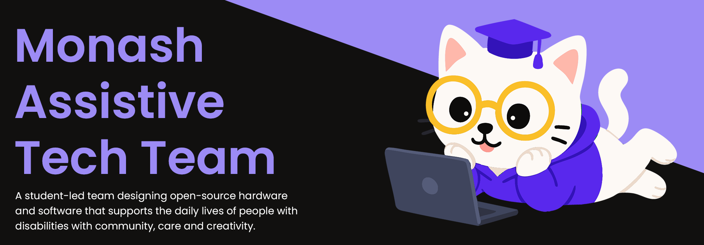

## Projects
Flagship projects being built by the students in our team.

### [More Than Words](https://github.com/MATTMonash/mtw-backend)
- This project supports neurodivergent individuals in intimate relationships by developing AI tools that enhance communication. It learns from expressive non-verbal cues like emojis, GIFs, and music, and later expands to text and tone. Co-designed with users and allies, it ensures practical, user-centered support. Privacy and user control are prioritised throughout.
